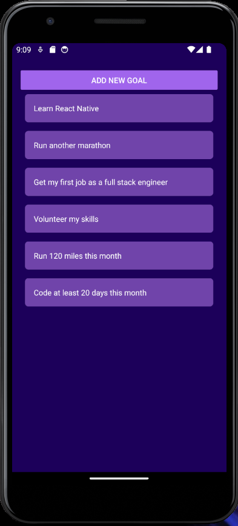

# Goals App - React Native 

  ## Description

  A simple mobile phone App where you can track your goals.  Add new goals, delete goals to the list.

  ### App screenshots:

  #### Add a goal:

  

  #### View your goal list:

  
  
  ## Table of Contents
  
  - [Installation](#installation)
  - [Usage](#usage)
  - [License](#license)
  - [Contributing](#contributing)
  - [Tests](#tests)
  - [Questions](#questions)
  
  ## Installation
  
  type 'npm install' in the command line, and run in an android or iPhone emulator (i.e. Android Studio for Android, Expo app or XCode for iPhone)
  
  ## Usage
  
  simply enter a goal in the input box and click add "ADD GOAL" and you will see the goal added to a list.  Click on an existing goal to delete it.

  ## License
This application is covered under the MIT License.
 For more information: https://opensource.org/licenses/MIT
  
  ## Contributing
  N/A
  
  ## Tests
  N/A

  ## Questions
  Contact Info 
  GitHub user name: BillStephens2022 
  Link to GitHub profile: https://github.com/BillStephens2022 
  Email: stephensbill17@gmail.com
